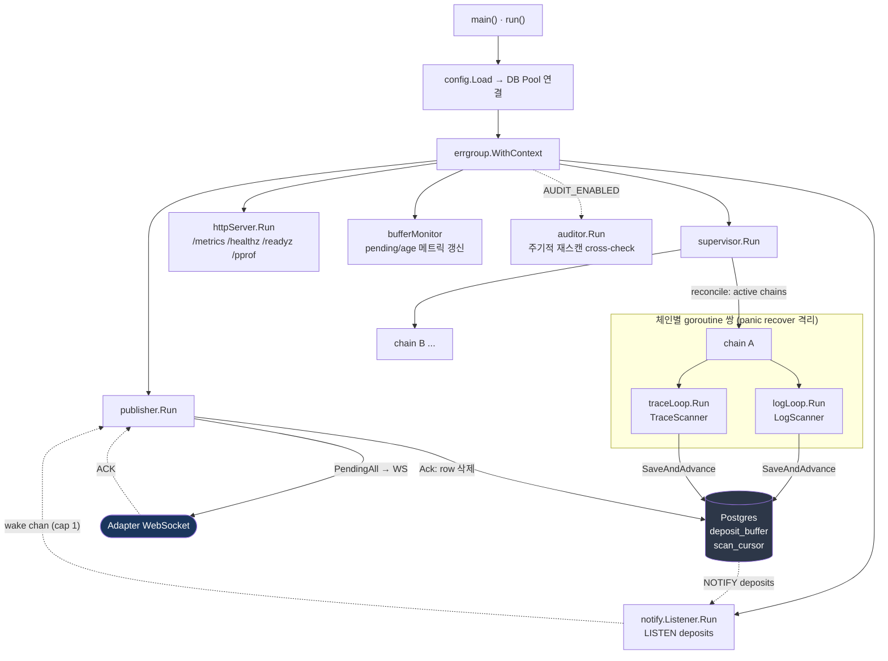
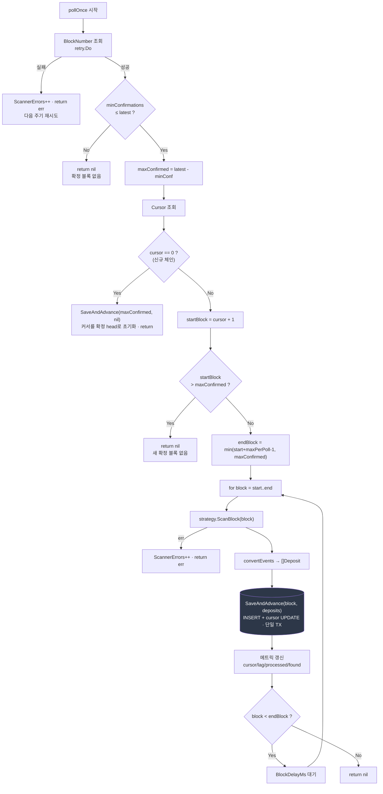
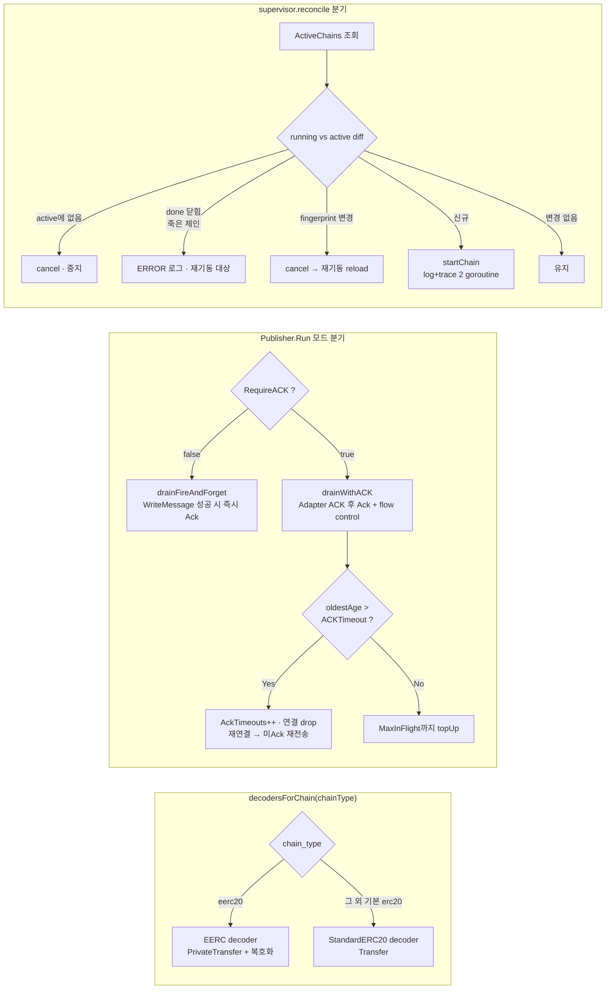

# 리스너 구조 흐름

실제 구현(`cmd/listener/main.go`, `internal/scanner`, `internal/supervisor`,
`internal/publisher`)을 기준으로 한 구조·흐름 다이어그램. 설계 배경은 [README](../README.md) 참고.

---

## 1. 프로세스 구조 — goroutine 구성

`main.go`의 `errgroup` wiring과 supervisor가 띄우는 체인별 goroutine 구조.
하나라도 죽으면 `ctx` 취소로 전부 정리된다.



---

## 2. 입금 감지 end-to-end (시퀀스)

scanner가 블록을 처리해 DB에 적재하고, LISTEN/NOTIFY로 publisher를 깨워 Adapter ACK까지 가는 정상 경로.

```mermaid
sequenceDiagram
    autonumber
    participant RPC as Chain RPC
    participant Loop as scanner.Loop<br/>(pollOnce)
    participant Scan as LogScanner
    participant DB as Postgres<br/>(BufferRepo)
    participant NL as notify.Listener
    participant Pub as Publisher
    participant Ad as Adapter

    loop PollingIntervalMs 마다
        Loop->>RPC: BlockNumber()
        RPC-->>Loop: latest
        Note over Loop: maxConfirmed = latest - minConfirmations<br/>confirmation gate
        Loop->>DB: Cursor(chainID, scanner)
        DB-->>Loop: cursor

        loop block = start..end
            Loop->>Scan: ScanBlock(block, confirmations)
            Scan->>RPC: FilterLogs / getBlock
            RPC-->>Scan: logs
            Scan->>DB: AccountRepo.HasMany(수신주소)
            DB-->>Scan: 내 계정 매칭분
            Scan-->>Loop: []DepositEvent

            Note over Loop,DB: 단일 트랜잭션
            Loop->>DB: SaveAndAdvance<br/>INSERT deposit_buffer + UPDATE scan_cursor
            DB->>DB: COMMIT
            DB-->>NL: NOTIFY deposits (입금 있을 때만)
        end
    end

    NL-->>Pub: wake (cap 1 신호)
    Pub->>DB: PendingAll(limit)
    DB-->>Pub: 미전송 Deposit[]
    Pub->>Ad: WriteMessage(deposit, id)
    Ad-->>Pub: {type:ack, id} (ACK 모드)
    Pub->>DB: BufferRepo.Ack → row 삭제
```

---

## 3. `pollOnce` 분기 처리 (한 사이클 의사결정)

`internal/scanner/loop.go`의 핵심 — **커서가 durable 저장 뒤에만 전진**하는 분기.



---

## 4. 런타임 분기 — decoder / publisher / supervisor

체인 타입, publisher 모드, reconcile 세 가지 런타임 분기.


